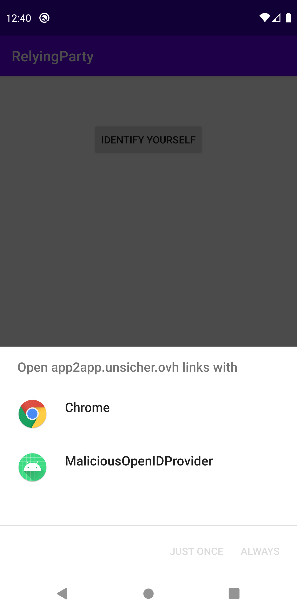
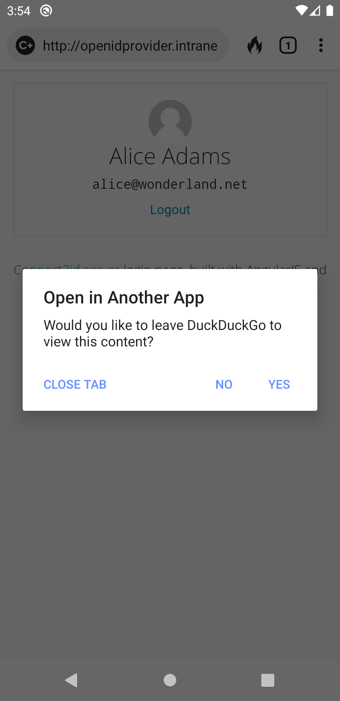

Authors:\
Fabian Hauck (yes.com)\
Daniel Fett (yes.com)\
Joseph Heenan (Authlete)

# app2app-evolution

OAuth flows on mobile devices can benefit a lot from native apps.
With native apps, for example, it is possible to use already existing 
sessions and biometric authentication features. While apps improve
the user experience they also bring new security challenges to 
OAuth. This document describes the challenge of app2app, app2web
and web2app redirection on Android and iOS.

## Problem Statement

When using OAuth to issue access tokens for protected
resources it is crucial to secure the issuance process. Therefore,
it is important that the Authorization Request and the Authorization
Response do not get hijacked by an adversary. 

If, for example, the
Authorization Response is hijacked and the client does not use
PKCE, the adversary could inject the stolen authorization code into his own 
session to get access to the victim's protected resources ([Code Injection](https://tools.ietf.org/id/draft-ietf-oauth-security-topics-14.html#rfc.section.4.5)). 
PKCE can help to protect against Code Injection, but if
the Authorization Request is hijacked as well, the attacker can 
modify it and use the resulting authorization code despite PKCE. This attack
is similar to the one described [here](https://web-in-security.blogspot.com/2017/01/pkce-what-cannot-be-protected.html).
Using a Pushed Authorization Request (PAR) or signing the Authorization 
Request will also not mitigate the attacks that are possible if the
OAuth redirection gets hijacked. Therefore, it is critical to
properly secure the redirection to the OpenID Provider (IDP). 

In a browser, it is generally secure to redirect the user using a URL,
but this is not the case on most mobile operating systems.
Android, for example, permits arbitrary apps to claim that they
handle a specific domain - even those installed from the Google Play Store. Although it is possible to verify a 
domain-app association ([Android App Link](https://developer.android.com/training/app-links)) 
this mechanism is not active if the respective app is not installed on
the device. In case the IDP app is not installed the user would
have to choose from a menu with which app he wants to open the URL.



As we can see in the picture a malicious OpenID Provider app also
claims to handle the authorization server's domain. In this case, the user could choose the
malicious app instead of the browser. 

Another problem on Android is the redirection back from the browser 
to the Relying Party app. If the RP app uses an Android
App Link and the user was redirected to the Chrome browser, the user
can be sent back to the app by simply being redirected to the Android
App Link. However, this does not work in most of the other browsers. To be
browser independent it is necessary to use a custom URL scheme.
Arbitrary apps, however, can register themselves
to handle the same custom scheme, making this technique susceptible to redirect
hijacking.

On iOS the situation is different. There, an app can only claim to
handle an `http://` or `https://` scheme URL if it can verify an association 
with the domain ([Universal Links](https://developer.apple.com/ios/universal-links/)).
Custom schemes, again, can be claimed by every app but the OS will
not display a selection menu - it will instead arbitrarily pick one of the apps.

## Attacker Model

This is a short summary of the attacker model which is by no 
means comprehensive.

The attacker has the following capabilities:

- can install apps that register the same custom scheme as an honest
app
- cannot install apps that verify an app association with a domain 
he does not control
- cannot manipulate the operating system


On Android:
- cannot install apps through the Play Store with the same 
applicationID as an honest app in the Play Store
- can install apps with the same applicationID as an honest 
app through a third-party app store or sideloading
- cannot sign an APK with a certificate he does not control

## Goals

1. When the user is redirected from the RP to the IDP, he should
either go to the legit app or to the default browser. If the 
default browser supports Android Custom Tabs, the website 
should be opened in a Custom Tab. There should never be a
menu where the user has to choose between multiple apps.

2. When the user is redirected from the IDP back to the RP,
he should either go directly back to the app/browser where he
started the process.

## Solution on iOS
On iOS, we can use Universal Links to redirect the user from one
app to another. The good thing here is that we can set a flag
called: ``.universalLinksOnly: true``. This will only redirect
the user if an app that has claims this link is installed and has
been verified by the OS for the domain.

```Swift
// if bank’s app is present & supports app2app, open it
UIApplication.shared.open(authorizationEndpointUrl, options: [.universalLinksOnly: true]) { (success) in
    if !success {
        // launching bank app failed: app does not support universal links or
        // bank’s app is not installed – open an in app browser tab instead
        <…continue as app did before app2app…>
    }
}
```
Source: [Blog post by Joseph Heenan](https://openid.net/2019/10/21/guest-blog-implementing-app-to-app-authorisation-in-oauth2-openid-connect/)

In case the app is not installed we can launch an
[ASWebAuthenticationSession](https://developer.apple.com/documentation/authenticationservices/aswebauthenticationsession)
that opens an in-app browser session powered by Safari.
Hereby it is possible to use existing session cookies from the
Safari browser. To redirect back to the app, the app specifies a
claimed https url before launching the browser. If the browser is 
redirected to the claimed https url the browser will exit and give
the URL back to the app.

## Limitations on iOS

If the user normally uses a browser other than the system Safari, it is at best difficult to return them to that browser in the web2app flow, and to send them to that browser in the app2web flow.

iOS14 should improve this situation by adding a [system level preference where the user can select an alternative browser](https://developer.apple.com/documentation/xcode/allowing_apps_and_websites_to_link_to_your_content/preparing_your_app_to_be_the_default_browser_or_email_client) - however the alternative browser will not be able to share cookies/sessions with the system Safari, and it is currently believed that ASWebAuthenticationSession will always be handled by the system Safari. Unfortunately the rules for 
alternate browsers do not currently seem to require them to implement Universal Links, nor to provide a similar user experience to Safari if they do support them.

iOS requires apps are signed using an extra permission that is manually granted by Apple before they can become the default browser, so it seems we can trust that the default browser is generally not malicious. 

For the OAuth client / relying party, if flows starting in both app and mobile web are supported, it's probably best to use different redirect uris depending on whether the flow starts in the app or in the mobile web browser, so there is a higher change the flow ends up back where the user started. (By contrast, the OAuth server / OpenID Provider should generally not use different urls for it's authorization endpoint for the web vs app flows, as there is no standard way to publish the alternate URL.)


## App2App and App2Web Solutions on Android

1. **Open app via HTTPS link**
   ```kotlin
    val uri =  Uri.parse("https://app2app.unsicher.ovh?request_uri=Hello_World")

    val browserIntent = Intent(Intent.ACTION_VIEW, uri)
    startActivity(browserIntent)
   ```

   If the app of the domain owner is installed and supports
   [Android App Links](https://developer.android.com/training/app-links) 
   the legit app will always be opened. If the domain owner
   app is not installed, the OS will display an app chooser
   dialog (as can be seen in the above screenshot). Since any
   app can claim to handle the domain name, the user could
   choose an app from an attacker.

2. **Open the web browser with an intent that has the category *CATEGORY_APP_BROWSER* set**
   ```kotlin
   val uri =  Uri.parse("https://app2app.unsicher.ovh?request_uri=Hello_World")

   val browserIntent = Intent.makeMainSelectorActivity(Intent.ACTION_MAIN, Intent.CATEGORY_APP_BROWSER)
   browserIntent.data = uri
   startActivity(browserIntent)
   ```
   This code forces the OS to open the link inside a web browser
   and not in an app that just claims to open this domain name.
   If the user has multiple browsers installed, he still has to
   choose between them.

   Note that in the Google Play Store is it not clear how hard it is to publish an app that provides CATEGORY_APP_BROWSER (whereas on iOS a signing permission manually granted by Apple is required for an app to be selectable as the default browser). 


3. **Use Android Custom Tabs**
   ```kotlin
   val uri =  Uri.parse("https://app2app.unsicher.ovh?request_uri=Hello_World")

   val builder = CustomTabsIntent.Builder()
   val customTabsIntent = builder.build()
   customTabsIntent.launchUrl(this, uri)
   ```
   This code opens an [Android Custom Tab](https://developer.chrome.com/multidevice/android/customtabs). 
   The problem here is that if the user does not 
   have a default browser (unlikely), he has to choose
   between all installed browsers. Additionally, if a
   malicious app is installed the user has to 
   choose between this app and the browser. It is a
   similar problem as in solution 1. 
   
   However a positive is that if the user chooses a browser 
   that does not support Custom Tabs, the browser application
   will launch.

4. **Set default browser as package in the Intent**
   ```kotlin
   val uri =  Uri.parse("https://app2app.unsicher.ovh?request_uri=Hello_World")

   val builder = CustomTabsIntent.Builder()
   val customTabsIntent = builder.build()
   val defaultBrowser = getDefaultBrowserPackageName()
   customTabsIntent.intent.setPackage(defaultBrowser)
   customTabsIntent.launchUrl(this, uri)

   private fun getDefaultBrowserPackageName(): String {
   /*
      Source: https://stackoverflow.com/questions/23611548/how-to-find-default-browser-set-on-android-device
   */
      val browserIntent = Intent(Intent.ACTION_VIEW, Uri.parse("http://"))
      val resolveInfo = packageManager.resolveActivity(browserIntent, PackageManager.MATCH_DEFAULT_ONLY)

      // This is the default browser's packageName
      return resolveInfo!!.activityInfo.packageName
   }
   ```
   To prevent the user from having to choose
   between multiple apps, an intent can be explicitly
   told which package it should use to execute
   the intent. In this example a Android Custom
   Tab is initialized and the 
   `getDefaultBrowserPackageName()` method
   checks what the package name of the user's
   default browser is.

   A problem with Chrome Custom Tabs is that if the
   user clicks on `Open in Chrome` and the OpenID Provider
   app is not installed but a malicious app is installed
   the user has to choose between Chrome and the malicious app.

### Problem with Solution 2 and 4
Solutions 2 and 4 have the problem that they will
open a web browser even if the app of the domain
owner is installed on the device. To open the
app if the app is installed it is necessary to
check whether the app is installed. The
code for this can be seen below. The app must, of
course, register the domain name as an Android
App Link.
```kotlin
val packageName = "com.example.openidprovider"

if (isAppInstalled(packageName)) {
   // Solution 1 -> will open the installed app because of the Android App Link
} else {
   // Solution 4 -> will open the website in a Chrome Custom Tab with the user's default browser
} 

private fun isAppInstalled(packageName: String): Boolean {
   /*
      Source: https://stackoverflow.com/questions/3922606/detect-an-application-is-installed-or-not
   */
   try {
      packageManager.getPackageInfo(
            packageName,
            PackageManager.GET_ACTIVITIES
      )
      return true
   } catch (e: PackageManager.NameNotFoundException) {
      return false
   }
}
```

**Note:** Since the package name of the app
is needed, it would be necessary to download it from 
``/.well-known/assetlinks.json``. An alternative would be to include it in
the OpenID Provider's metadata ([RFC 8414](https://tools.ietf.org/html/rfc8414#section-2)), but a method to do this has not been standardized. 

From Android 11, the [app will need to request extra permissions](https://developer.android.com/preview/privacy/package-visibility) to use the package manager APIs.


### Problem with Android App Links
If an IDP app is responsible for several hundred domains,
the app has to register an Android App Link for every single
domain. If one of these registrations fails, none of them would be valid.
Additionally, the OS has to download a document from every
single domain. This could be a problem in situations like low bandwidth or high latency networks.

To solve this the Relying Party could add the package name to the
intent that opens the redirect URL. This would ensure that the 
correct app opens without Android App Links. It is also a good 
solution since we already need to have have the package name of the IDP
app to use the above `isAppInstalled`.

```kotlin
val uri =  Uri.parse("https://app2app.unsicher.ovh?request_uri=Hello_World")
val packageName = "com.example.openidprovider"

val redirectIntent = Intent(Intent.ACTION_VIEW, uri)
redirectIntent.setPackage(packageName)
startActivity(redirectIntent)
```

This, by itself, is not a direct replacement for Android AppLinks - for the app2app use case, the main difference is the application signature is not verified using this method.

### Problem with Alternative App Stores
Since Android is an open system it is possible to install apps 
from other sources than the Play Store. While it is guaranteed 
that the package name of apps from the Play Store is unique this 
does not apply to apps installed from other sources. One possibility
to overcome this security threat is to check the signing certificate
of the app we want to open. This can be done in the ``isAppInstalled``
method in the following way:

```kotlin
private fun isAppLegit(packageName: String): Boolean {
   try {
      // Try to query the signing certificates of the
      // IDP app. If the IDP app is not installed this
      // operation will throw an error.
      val signingInfo: SigningInfo = packageManager.getPackageInfo(
         packageName,
         PackageManager.GET_SIGNING_CERTIFICATES
      ).signingInfo
      val signatures: Array<Signature> = signingInfo.signingCertificateHistory

      // calculate the hashes of the signing certificates
      val signatureStrings = generateSignatureHashes(signatures)

      // Compare the hashes with a predefined list of
      // certificate hashes for the app.
      return matchHashes(signatureStrings, IDP_SIGNATURE_HASHES)
   } catch (e: PackageManager.NameNotFoundException) {
      return false
   }
}
```
The `generateSignatureHashes` method is found in [AppAuth-Android](https://github.com/openid/AppAuth-Android/blob/0875455b1390c49c4d6b2aaeee01a3cbf93d3407/library/java/net/openid/appauth/browser/BrowserDescriptor.java#L159).

For this solution, as well as the package name, we also need
the hashes of the certificates that were used to sign the APK.
This can either be put into the OAuth/OpenID Discovery document or if the
IDP app uses Android App Links the hash can be found in the
``/.well-known/assetlinks.json`` file.


### App2App Backwards Redirection

To redirect back from the OpenID Provider app to the calling
activity in the Relying Party app we can use the method
``startActivityForResult()``. This has two advantages: First
the OpenID Provider app can get the package name of the calling
app with ``callingActivity?.packageName`` and second the IDP  app
can redirect to the calling app with the ``setResult()`` method.

Nevertheless, the IDP app should check if the redirect_uri from the AS, 
the package name, and the certificate fingerprint of the calling app
matches. This should be done like this:

```kotlin
val foundPackageName: String? = callingActivity?.packageName

val (basePackageName, baseCertFingerprints) = getAssetLinksJsonFile(uri)
val foundCertFingerprints = getSigningCertificates(foundPackageName)

if (matchHashes(foundCertFingerprints, baseCertFingerprints)
   && foundPackageName == basePackageName) {
   // Everything is fine call setResult()
} else {
   // Something is wrong with the installed app.
   // Redirect the user to the browser.
}
```

**Problem with this approach:**

When an activity is launched with `startActivityForResult()` care is required when the iDP app launches further activities, such as sub-activities to request login or 2-factor authentication.

The 1.2.0 release of androidx.activity provides APIs that simplify this process, though currently (August 2020) this version is still an alpha release.

https://developer.android.com/training/basics/intents/result

### User's Default Browser Selection Considerations
The selection of any browser that the user has set as the default 
browser bears risks for user experience and security. 

**For example:**

**DuckDuckGo and Puffin:** If the browser is redirected to a URL
with a custom scheme that opens another app, the
browser warns the user.




#### Safe Browsers
The following browsers generate the intended 
user experience:

1. **Chrome** (especially Chrome Custom Tabs)
2. **Firefox** (also supports Custom Tabs)
3. **Opera** 

JJH: Is this section only talking about custom url schemes?

JJH: I'm interested to know what browsers were considered here - https://www.netmarketshare.com/browser-market-share.aspx?options=%7B%22filter%22%3A%7B%22%24and%22%3A%5B%7B%22deviceType%22%3A%7B%22%24in%22%3A%5B%22Mobile%22%5D%7D%7D%2C%7B%22platform%22%3A%7B%22%24in%22%3A%5B%22Android%22%5D%7D%7D%5D%7D%2C%22dateLabel%22%3A%22Custom%22%2C%22attributes%22%3A%22share%22%2C%22group%22%3A%22browser%22%2C%22sort%22%3A%7B%22share%22%3A-1%7D%2C%22id%22%3A%22browsersDesktop%22%2C%22dateInterval%22%3A%22Monthly%22%2C%22dateStart%22%3A%222020-06%22%2C%22dateEnd%22%3A%222020-06%22%2C%22segments%22%3A%22-1000%22%2C%22hiddenSeries%22%3A%7B%7D%7D suggests we should probably explicitly comment on Samsung Browser.

## Web2App Solutions on Android

1. Use Android App Links
   ```html
   <a href="https://app2app.unsicher.ovh/?code=foo_bar">To app via HTTPS</a>
   ```
   If an app is installed that has the domain name
   registered via [Android App Link](https://developer.android.com/training/app-links)
   and the website was opened in the Chrome browser
   the user will be redirected to the app without an
   app selection dialog. If no app with Android App
   Link is installed the session will continue in Chrome
   browser.
   
   If the website was opened in another browser,
   the user will be redirected to the website and not
   the app.

   Another problem arises if the IDP website is opened in a
   Firefox Custom Tab and the user is redirected to the RP website
   inside the Custom Tab. Now he decides to click on "Open in Firefox".
   If the right app with an Android App Link is not installed he
   has to possible choose between the Firefox browser and
   a malicious app that has registered itself for the
   domain name. 
   JJH: i'm guessing only firefox has this behaviour? Is it resolved in fenix? ( https://www.ctrl.blog/entry/review-firefox-fenix-android.html )

2. Use a custom scheme
   ```html 
   <a href="com.example.relyingparty://completed/?code=foo_bar">To app via custom scheme</a>
   ```
   This solution has the advantage that every 
   browser will open the app that supports the
   scheme. The disadvantage is that any app
   can register itself for the scheme. So an
   adversary could install an app for that scheme
   and then the user has to choose between apps.

   Implementing a fallback if the app is not installed is possible but a little involved.

3. Use the intent scheme
   ```html
   <!-- Source: https://developer.chrome.com/multidevice/android/intents -->
   <a href="intent://relyingparty.intranet/?code=foo_bar#Intent;scheme=http;package=com.example.relyingparty;S.browser_fallback_url=https://app2app.unsicher.ovh/?code=foo_bar;end">To app via intent scheme</a>
   ```
   The [intent scheme](https://developer.chrome.com/multidevice/android/intents) 
   will use the package name to find an app to open the URL. 
   This scheme is essentially handled as an Android Intent 
   by the system and works in every browser. If no app with 
   the package name is found, the user will be redirected to 
   the URL specified in the ``S.browser_fallback_url`` parameter.

   Since we can only specify the package name a malicious
   app from another app store could hijack this kind of
   redirection. To prevent this we would need a
   feature to specify the signing certificate hash of
   the target app. But this feature is not available.

   The problem with the intent scheme and OAuth 2.0
   is that the intent specification is in the
   fragment part of the URL. Since OAuth 2.0 just
   uses the redirect_uri and appends the 
   parameters, it is not directly possible to use
   this type of URL. In fact, it is explicitly forbidden by RFC6749. But if we redirect the 
   browser to a backend endpoint that
   redirects the browser to a URL with the intent
   scheme it is possible to use an existing AS
   without modifications - though compared to App Links redirecting via the web browser is a poorer UX and leaves a tab open in the user's browser.


## Proposed Solution on Android

After seeing so many possible solutions for Android, what are the best techniques for Android? This section 
describes the proposed best current practice solution for Android. It is 
divided into the redirection from the RP app to the IDP, the IDP app to the RP, and the IDP website to the RP. This solution will not use
Android App Links due to the problems noted above, but will instead set the package name of the apps
explicitly to the Android Intent.

### RP App to IDP

To redirect from the RP app to the IDP, the RP app has to check whether 
the IDP app is installed. It does this by requesting the certificate
with which the IDP app was signed from the Android Package Manager. If the
app is not installed, the Package Manager will throw an exception.
After this, the certificate hash has to be compared with the hash that is
found in the ``/.well-known/assetlinks.json`` file. If they are the same,
the RP app can redirect the user to the IDP app with an Android Intent
that has the package name of the IDP app set. The Intent can either be started
with the method ``startActivity()`` or ``startActivityForResult()``. 

If the IDP app is not
installed, the RP app has to determine the user's default browser
and compare the certificate hash of this browser with a hardcoded hash.
If this is successful, the RP app can open the browser with an Android
Intent that has the package name of the default browser set.


**Example Code:**

```kotlin
// use methods from the AppAuth-Android project: https://github.com/openid/AppAuth-Android
import net.openid.appauth.browser.BrowserAllowList
import net.openid.appauth.browser.BrowserSelector
import net.openid.appauth.browser.VersionedBrowserMatcher

/**
* Main method to do the redirection
*/
fun secureRedirection(uri: Uri) {
   val (basePackageName, baseCertFingerprints) = getAssetLinksJsonFile(uri)
   // JJH: I think in the general case it's possible to have more than one package name match a given uri? https://stackoverflow.com/questions/48056006/how-to-create-assetlinks-json-when-website-is-handled-by-multiple-apps - so this should perhaps return an array? (I also can't find the source for this function)

   if (isAppLegit(basePackageName, baseCertFingerprints)) {
      val redirectionIntent = Intent(Intent.ACTION_VIEW, uri)
      redirectionIntent.setPackage(basePackageName)
      startActivity(redirectionIntent)
   } else {
      redirectToWeb(uri)
   }
}

fun redirectToWeb(uri: Uri) {
    val builder = CustomTabsIntent.Builder()
    val customTabsIntent = builder.build()

    // find a suitable browser to open the URL
    val browserDescriptor = BrowserSelector.select(
        context, 
        BrowserAllowList(
            VersionedBrowserMatcher.CHROME_CUSTOM_TAB,
            VersionedBrowserMatcher.CHROME_BROWSER,
            VersionedBrowserMatcher.FIREFOX_CUSTOM_TAB,
            VersionedBrowserMatcher.FIREFOX_BROWSER,
            VersionedBrowserMatcher.SAMSUNG_CUSTOM_TAB,
            VersionedBrowserMatcher.SAMSUNG_BROWSER
        )    
    )

    if (browserDescriptor != null) {
        customTabsIntent.intent.apply {
            setPackage(browserDescriptor.packageName)
        }
        customTabsIntent.launchUrl(context, uri)
    } else {
        Toast.makeText(context, "Could not find a browser", Toast.LENGTH_SHORT).show()
    }
}

fun isAppLegit(
    packageName: String,
    baseCertFingerprints: Set<String>
): Boolean {
    val foundCertFingerprints = getSigningCertificates(packageName)
    if (foundCertFingerprints != null) {
        return matchHashes(baseCertFingerprints, foundCertFingerprints)
    }
    return false
}

fun matchHashes(certHashes0: Set<String>, certHashes1: Set<String>): Boolean {
    if (certHashes0.containsAll(certHashes1)
        && certHashes0.size == certHashes1.size
    ) {
        return true
    }
    return false
}

fun getSigningCertificates(packageName: String): Set<String>? {
    try {
        // Try to query the signing certificates of the
        // IDP app. If the IDP app is not installed this
        // operation will throw an error.
        val signatures: Array<Signature>?
        if (android.os.Build.VERSION.SDK_INT >= android.os.Build.VERSION_CODES.P) {
            val signingInfo = packageManager.getPackageInfo(
                packageName,
                PackageManager.GET_SIGNING_CERTIFICATES
            ).signingInfo
            signatures = signingInfo.signingCertificateHistory
        } else {
            signatures = packageManager.getPackageInfo(
                packageName,
                PackageManager.GET_SIGNATURES
            ).signatures
        }

        // calculate the hashes of the signing certificates
        val foundCertFingerprints = generateSignatureHashes(signatures)

        return foundCertFingerprints
    } catch (e: PackageManager.NameNotFoundException) {
        return null
    }
}
```

### IDP App to RP

Concerning this redirection we have two cases that depend on whether the
method ``startActivityForResult()`` is used to start the IDP app.

**Case 1:** `getCallingActivity()` is null

`startActivityForResult()` was not used from the RP app to the IDP app

In this case we can use the exact same method from above (``secureRedirection(uri: Uri)``).

As noted for iOS, the RP native app may want to use a different redirect url to the web app if the user may start the flow from the system browser despite having the RP app installed.

**Case 2:**  `getCallingActivity()` is not null

This means `startActivityForResult()` was used.

In this case the IDP app knows the package name of the calling app. With the 
package name, the IDP app can get the signing certificate of the
calling app. This information can be compared with the values that are 
stored in the  ``/.well-known/assetlinks.json`` file of the redirect_uri 
domain. If all these values match and the redirect_uri is a registered one for that RP, 
the IDP app can redirect the user back to the RP app with the 
method ``setResult()``.


**Example Code:**

```kotlin
/**
* Method to redirect back to the RP app if the IDP app 
* is started with 'startActivityForResult()'.
*/
fun secureRedirectionBackwards(uri: Uri) {
   val foundPackageName: String? = callingActivity?.packageName
   if (foundPackageName != null) {
      val (basePackageName, baseCertFingerprints) = getAssetLinksJsonFile(uri)
      val foundCertFingerprints = getSigningCertificates(foundPackageName)

      if (foundCertFingerprints != null
         && matchHashes(foundCertFingerprints, baseCertFingerprints)
         && foundPackageName == basePackageName
      ) {
         val redirectionIntent = Intent(Intent.ACTION_VIEW, uri)
         setResult(0, redirectionIntent)
         finish()
      } else {
         redirectToWeb(uri)
      }

   } else {
      redirectToWeb(uri)
   }
}
```


### IDP Web to RP

The redirect_uri should depend on whether the user starts a flow
on the web or the Android app. This diagram shows the case
where the user started in the RP app but was redirected to the web 
because the IDP app was not installed. In this case, the redirect_uri
should point to an endpoint of the RP that takes the parameters from
the Authorization Response and redirects the browser to a URL that uses
the intent:// scheme. In this intent:// scheme the RP can set the package
name of the RP app. Since we started the flow inside the RP app the user
will be redirected to the legit app.

JJH: I think the 'since' makes the assumption in-app browser tabs are supported by the user's browser? If not I don't understand it. Or is the assumption that the flow started in the genuine RP app? I'm not sure we can guarantee that. We can guarantee the user doesn't end up back in a browser/malicious app with a different package id, but it's upto the RP to verify if the RP app in use is genuine.


**Example Code:**

```kotlin
/**
* Example Java Spring rest controller endpoint to
* rewrite the URL.
*/
@GetMapping("/complete")
fun complete(@RequestParam code: String): RedirectView {
   val redirection = RedirectView()
   val codeEncoded = URLEncoder.encode(code, StandardCharsets.UTF_8)
   redirection.url = "intent://relyingparty.intranet/complete?code=${codeEncoded}#Intent;scheme=http;package=com.example.relyingparty;S.browser_fallback_url=http://relyingpart.intranet/website;end"
   return redirection
}
```

## Limitations on Android

While redirecting from app2app and app2web can be secured really
well on Android, it is difficult to secure the web2app redirection.
There are two essential problems. First, Android App Links are only
supported by the Chrome browser and second, it is not possible
to set the certificate hash of the target app in the intent
scheme. If either of these problems would be solved we could
safely redirect from the web to an app. So at the moment there
are two options: Either the user is only allowed to use the
Chrome browser which is not possible if he starts the flow
in another browser or we have to accept the risk that the
redirection could get hijacked by an app that was installed
from an alternative app store with the same package name.

To solve this, we strongly recommend that alternate browsers are enhanced to support app links in the same way Chrome does.
